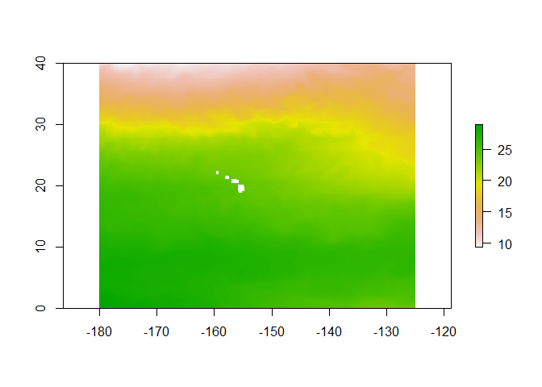
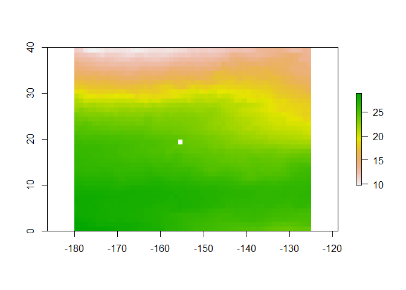
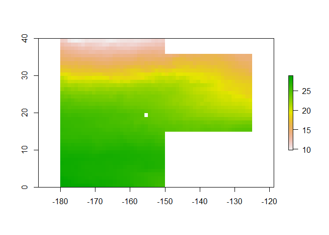
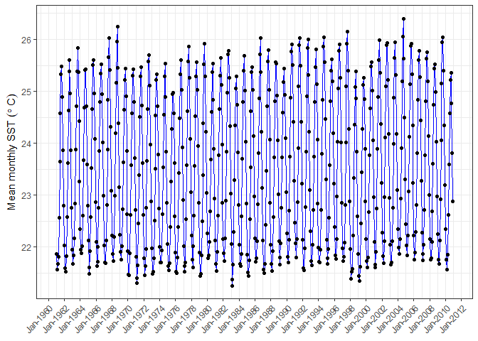

Accessing data from ISIMIP repository
================
Denisse Fierro Arcos
2023-08-19

- [Introduction](#introduction)
  - [Loading R libraries](#loading-r-libraries)
  - [Using Python in an R notebook](#using-python-in-an-r-notebook)
  - [Loading ISIMIP Client script](#loading-isimip-client-script)
  - [Starting an `isimip-client`
    session](#starting-an-isimip-client-session)
    - [Extracting data for a region](#extracting-data-for-a-region)
  - [Downloading data to disk](#downloading-data-to-disk)
- [R-based code](#r-based-code)
  - [Inspecting contents of netcdf
    file](#inspecting-contents-of-netcdf-file)
  - [Masking temperature using region
    shapefile](#masking-temperature-using-region-shapefile)
  - [Loading dataset as dataframe for easy
    manipulation](#loading-dataset-as-dataframe-for-easy-manipulation)
  - [Calculating climatology](#calculating-climatology)
  - [Plotting climatology](#plotting-climatology)

# Introduction

This notebook will accessing data from the [Inter-Sectoral Impact Model
Intercomparison Project (ISIMIP) Repository](https://data.isimip.org/).
There are various datasets available, but as example we will be
accessing Input Data \> Climate Forcing \> ISIMIP3a simulation round. We
will use the sea surface temperature (`tos`) monthly global output from
the GFDL-MOM6-COBALT2 model.

In this notebook, we will use `Python` to make use of some functions
from the `isimip-client` library, which you should have already
installed in your local machine if you followed the instructions in the
`README` file. If you have not done this yet, make sure you follow these
instructions before running this notebook.

After we have downloaded the data we need with the `isimip-client`
library, we will then move to `R` to visualise the data.

## Loading R libraries

All libraries used in this notebook should already be installed in your
local machine. Make sure you follow the instructions in the `README`
file before running this notebook.

``` r
library(reticulate)
library(tidyverse)
library(metR)
library(lubridate)
library(raster)
library(sf)
```

## Using Python in an R notebook

We will use the `reticulate` package to call `Python` in this notebook.
Before you run this, make sure you have edited the `.Rprofile` file
following the instructions in the README.

``` r
#Calling a specific conda environment
use_condaenv("fishmip")
```

## Loading ISIMIP Client script

We can call the `isimip-client` library and load it into `R` as shown
below. We can then use the `$` sign to call the different modules
available in the library.

``` r
#Loading isimip-client into R
cl <- import("isimip_client.client")
```

``` python
#Loading the library
import isimip_client.client as cl

#Starting a session
client = cl.ISIMIPClient()
```

## Starting an `isimip-client` session

By starting a session we can query the ISIMIP database. We will look for
climate data (considered as Input Data) from the ISIMIP3a simulation. We
will search for monthly sea surface temperature (`tos`) outputs from the
GFDL-MOM6-COBALT2 earth system model.

There are several parameters available to perform a search. It is beyond
the scope of this training session to cover all options, but the best
way to familiarise yourself with the parameters available is by
searching a variable of your interest in the ISIMIP Repository website.
You can click
[here](https://data.isimip.org/datasets/d7aca05a-27de-440e-a5b2-2c21ba831bcd/)
for the results of the search described here. The parameters used here
can be seen under the `Specifiers` section in the link above.

``` python
#Starting a query - Looking for climate inputs from the ISIMIP3a simulation
query = client.datasets(simulation_round = 'ISIMIP3a',\
                           product = 'InputData',\
                           category = 'climate',
                           climate_forcing = 'gfdl-mom6-cobalt2',\
                           climate_scenario = 'obsclim',\
                           subcategory = 'ocean',\
                           region = 'global',\
                           time_step = 'monthly',\
                           resolution = '60arcmin',\
                           climate_variable = 'tos')

query
```

    ## {'count': 1, 'next': None, 'previous': None, 'results': [{'id': '179aa813-a065-470b-9010-ff6b3213152a', 'name': 'gfdl-mom6-cobalt2_obsclim_tos_60arcmin_global_monthly', 'path': 'ISIMIP3a/InputData/climate/ocean/obsclim/global/monthly/historical/GFDL-MOM6-COBALT2/gfdl-mom6-cobalt2_obsclim_tos_60arcmin_global_monthly', 'paths': ['ISIMIP3a/InputData/climate/ocean/obsclim/global/monthly/historical/GFDL-MOM6-COBALT2/gfdl-mom6-cobalt2_obsclim_tos_60arcmin_global_monthly'], 'version': '20221117', 'size': 76310476, 'specifiers': {'region': 'global', 'product': 'InputData', 'category': 'climate', 'time_step': 'monthly', 'resolution': '60arcmin', 'subcategory': 'ocean', 'climate_forcing': 'gfdl-mom6-cobalt2', 'climate_scenario': 'obsclim', 'climate_variable': 'tos', 'simulation_round': 'ISIMIP3a'}, 'identifiers': ['simulation_round', 'product', 'category', 'subcategory', 'climate_scenario', 'region', 'time_step', 'climate_forcing', 'climate_variable', 'resolution'], 'search_rank': 0.0, 'public': True, 'restricted': False, 'merged_specifiers': {'region': ['global'], 'product': ['InputData'], 'category': ['climate'], 'time_step': ['monthly'], 'resolution': ['60arcmin'], 'subcategory': ['ocean'], 'climate_forcing': ['gfdl-mom6-cobalt2'], 'climate_scenario': ['obsclim'], 'climate_variable': ['tos'], 'simulation_round': ['ISIMIP3a']}, 'pretty_specifiers': {'Simulation round': ['ISIMIP3a simulation round'], 'Data product': ['Input Data'], 'Input category': ['Climate related forcing'], 'Input subcategory': ['Ocean'], 'Climate scenario': ['obsclim'], 'Region': ['Global'], 'Time step': ['monthly'], 'Climate forcing': ['GFDL-MOM6-COBALT2'], 'Climate variable': ['tos'], 'Spatial resolution': ['60arcmin']}, 'url': 'https://data.isimip.org/api/v1/datasets/179aa813-a065-470b-9010-ff6b3213152a/', 'metadata_url': 'https://data.isimip.org/datasets/179aa813-a065-470b-9010-ff6b3213152a/', 'filelist_url': 'https://data.isimip.org/api/v1/datasets/179aa813-a065-470b-9010-ff6b3213152a/filelist/', 'rights': {'rights': 'Attribution 4.0 International', 'rights_uri': 'https://creativecommons.org/licenses/by/4.0/', 'short': 'CC BY 4.0', 'image': 'images/cc/by.png', 'color': 'success'}, 'files': [{'id': '9b88129a-f3cf-412c-9408-cd32ef026504', 'name': 'gfdl-mom6-cobalt2_obsclim_tos_60arcmin_global_monthly_1961_2010.nc', 'path': 'ISIMIP3a/InputData/climate/ocean/obsclim/global/monthly/historical/GFDL-MOM6-COBALT2/gfdl-mom6-cobalt2_obsclim_tos_60arcmin_global_monthly_1961_2010.nc', 'paths': ['ISIMIP3a/InputData/climate/ocean/obsclim/global/monthly/historical/GFDL-MOM6-COBALT2/gfdl-mom6-cobalt2_obsclim_tos_60arcmin_global_monthly_1961_2010.nc'], 'version': '20221117', 'size': 76310476, 'checksum': '0396415e04627575fef180d6cf4c7a747f4a048562964c8316e5e0f6cb9594d5e5da14338647c179fadfb756f5e5027da0954b290d6fd4fddaaca24a4b8130b6', 'checksum_type': 'sha512', 'url': 'https://data.isimip.org/api/v1/files/9b88129a-f3cf-412c-9408-cd32ef026504/', 'metadata_url': 'https://data.isimip.org/files/9b88129a-f3cf-412c-9408-cd32ef026504/', 'file_url': 'https://files.isimip.org/ISIMIP3a/InputData/climate/ocean/obsclim/global/monthly/historical/GFDL-MOM6-COBALT2/gfdl-mom6-cobalt2_obsclim_tos_60arcmin_global_monthly_1961_2010.nc', 'rights': {'rights': 'Attribution 4.0 International', 'rights_uri': 'https://creativecommons.org/licenses/by/4.0/', 'short': 'CC BY 4.0', 'image': 'images/cc/by.png', 'color': 'success'}, 'terms_of_use': {'terms_of_use': 'When using ISIMIP data for your research, please appropriately credit the data providers, e.g. either by citing the DOI for the dataset, or by appropriate acknowledgment. We strongly encourage to offer co-authorship to at least a representative of the data providers.', 'terms_of_use_url': 'https://www.isimip.org/gettingstarted/terms-of-use/#general-terms-of-use-for-all-isimip-data-on-the-esg-server'}}], 'links': [], 'resources': [{'id': '48445f6b-0e9a-4a62-abb3-f84d814f95f6', 'doi': '10.48364/ISIMIP.920945', 'doi_url': 'https://doi.org/10.48364/ISIMIP.920945', 'citation': 'Xiao Liu, Charles Stock, John Dunne, Minjin Lee, Elena Shevliakova, Sergey Malyshev, Paul C.D. Milly, Matthias Büchner (2022): ISIMIP3a ocean physical and biogeochemical input data [GFDL-MOM6-COBALT2 dataset] (v1.0). ISIMIP Repository. https://doi.org/10.48364/ISIMIP.920945', 'is_current_version': True}], 'caveats': None, 'caveats_versions': None, 'annotations': None, 'indicators': None, 'terms_of_use': {'terms_of_use': 'When using ISIMIP data for your research, please appropriately credit the data providers, e.g. either by citing the DOI for the dataset, or by appropriate acknowledgment. We strongly encourage to offer co-authorship to at least a representative of the data providers.', 'terms_of_use_url': 'https://www.isimip.org/gettingstarted/terms-of-use/#general-terms-of-use-for-all-isimip-data-on-the-esg-server'}, 'is_global': True, 'is_netcdf': True}]}

We can check the number of results we obtained from our query.

``` python
query['count']
```

    ## 1

Our query produced two results. These are stored as a list. We can check
the information included in our query by typing `query$results`. But for
now, we will check the names of the variables included in our search.

``` python
query['results'][0]
```

    ## {'id': '179aa813-a065-470b-9010-ff6b3213152a', 'name': 'gfdl-mom6-cobalt2_obsclim_tos_60arcmin_global_monthly', 'path': 'ISIMIP3a/InputData/climate/ocean/obsclim/global/monthly/historical/GFDL-MOM6-COBALT2/gfdl-mom6-cobalt2_obsclim_tos_60arcmin_global_monthly', 'paths': ['ISIMIP3a/InputData/climate/ocean/obsclim/global/monthly/historical/GFDL-MOM6-COBALT2/gfdl-mom6-cobalt2_obsclim_tos_60arcmin_global_monthly'], 'version': '20221117', 'size': 76310476, 'specifiers': {'region': 'global', 'product': 'InputData', 'category': 'climate', 'time_step': 'monthly', 'resolution': '60arcmin', 'subcategory': 'ocean', 'climate_forcing': 'gfdl-mom6-cobalt2', 'climate_scenario': 'obsclim', 'climate_variable': 'tos', 'simulation_round': 'ISIMIP3a'}, 'identifiers': ['simulation_round', 'product', 'category', 'subcategory', 'climate_scenario', 'region', 'time_step', 'climate_forcing', 'climate_variable', 'resolution'], 'search_rank': 0.0, 'public': True, 'restricted': False, 'merged_specifiers': {'region': ['global'], 'product': ['InputData'], 'category': ['climate'], 'time_step': ['monthly'], 'resolution': ['60arcmin'], 'subcategory': ['ocean'], 'climate_forcing': ['gfdl-mom6-cobalt2'], 'climate_scenario': ['obsclim'], 'climate_variable': ['tos'], 'simulation_round': ['ISIMIP3a']}, 'pretty_specifiers': {'Simulation round': ['ISIMIP3a simulation round'], 'Data product': ['Input Data'], 'Input category': ['Climate related forcing'], 'Input subcategory': ['Ocean'], 'Climate scenario': ['obsclim'], 'Region': ['Global'], 'Time step': ['monthly'], 'Climate forcing': ['GFDL-MOM6-COBALT2'], 'Climate variable': ['tos'], 'Spatial resolution': ['60arcmin']}, 'url': 'https://data.isimip.org/api/v1/datasets/179aa813-a065-470b-9010-ff6b3213152a/', 'metadata_url': 'https://data.isimip.org/datasets/179aa813-a065-470b-9010-ff6b3213152a/', 'filelist_url': 'https://data.isimip.org/api/v1/datasets/179aa813-a065-470b-9010-ff6b3213152a/filelist/', 'rights': {'rights': 'Attribution 4.0 International', 'rights_uri': 'https://creativecommons.org/licenses/by/4.0/', 'short': 'CC BY 4.0', 'image': 'images/cc/by.png', 'color': 'success'}, 'files': [{'id': '9b88129a-f3cf-412c-9408-cd32ef026504', 'name': 'gfdl-mom6-cobalt2_obsclim_tos_60arcmin_global_monthly_1961_2010.nc', 'path': 'ISIMIP3a/InputData/climate/ocean/obsclim/global/monthly/historical/GFDL-MOM6-COBALT2/gfdl-mom6-cobalt2_obsclim_tos_60arcmin_global_monthly_1961_2010.nc', 'paths': ['ISIMIP3a/InputData/climate/ocean/obsclim/global/monthly/historical/GFDL-MOM6-COBALT2/gfdl-mom6-cobalt2_obsclim_tos_60arcmin_global_monthly_1961_2010.nc'], 'version': '20221117', 'size': 76310476, 'checksum': '0396415e04627575fef180d6cf4c7a747f4a048562964c8316e5e0f6cb9594d5e5da14338647c179fadfb756f5e5027da0954b290d6fd4fddaaca24a4b8130b6', 'checksum_type': 'sha512', 'url': 'https://data.isimip.org/api/v1/files/9b88129a-f3cf-412c-9408-cd32ef026504/', 'metadata_url': 'https://data.isimip.org/files/9b88129a-f3cf-412c-9408-cd32ef026504/', 'file_url': 'https://files.isimip.org/ISIMIP3a/InputData/climate/ocean/obsclim/global/monthly/historical/GFDL-MOM6-COBALT2/gfdl-mom6-cobalt2_obsclim_tos_60arcmin_global_monthly_1961_2010.nc', 'rights': {'rights': 'Attribution 4.0 International', 'rights_uri': 'https://creativecommons.org/licenses/by/4.0/', 'short': 'CC BY 4.0', 'image': 'images/cc/by.png', 'color': 'success'}, 'terms_of_use': {'terms_of_use': 'When using ISIMIP data for your research, please appropriately credit the data providers, e.g. either by citing the DOI for the dataset, or by appropriate acknowledgment. We strongly encourage to offer co-authorship to at least a representative of the data providers.', 'terms_of_use_url': 'https://www.isimip.org/gettingstarted/terms-of-use/#general-terms-of-use-for-all-isimip-data-on-the-esg-server'}}], 'links': [], 'resources': [{'id': '48445f6b-0e9a-4a62-abb3-f84d814f95f6', 'doi': '10.48364/ISIMIP.920945', 'doi_url': 'https://doi.org/10.48364/ISIMIP.920945', 'citation': 'Xiao Liu, Charles Stock, John Dunne, Minjin Lee, Elena Shevliakova, Sergey Malyshev, Paul C.D. Milly, Matthias Büchner (2022): ISIMIP3a ocean physical and biogeochemical input data [GFDL-MOM6-COBALT2 dataset] (v1.0). ISIMIP Repository. https://doi.org/10.48364/ISIMIP.920945', 'is_current_version': True}], 'caveats': None, 'caveats_versions': None, 'annotations': None, 'indicators': None, 'terms_of_use': {'terms_of_use': 'When using ISIMIP data for your research, please appropriately credit the data providers, e.g. either by citing the DOI for the dataset, or by appropriate acknowledgment. We strongly encourage to offer co-authorship to at least a representative of the data providers.', 'terms_of_use_url': 'https://www.isimip.org/gettingstarted/terms-of-use/#general-terms-of-use-for-all-isimip-data-on-the-esg-server'}, 'is_global': True, 'is_netcdf': True}

We can check some metadata for all the results with the following code.

``` python
for ds in query['results']:
  print(ds['name'], ds['files'])
```

    ## gfdl-mom6-cobalt2_obsclim_tos_60arcmin_global_monthly [{'id': '9b88129a-f3cf-412c-9408-cd32ef026504', 'name': 'gfdl-mom6-cobalt2_obsclim_tos_60arcmin_global_monthly_1961_2010.nc', 'path': 'ISIMIP3a/InputData/climate/ocean/obsclim/global/monthly/historical/GFDL-MOM6-COBALT2/gfdl-mom6-cobalt2_obsclim_tos_60arcmin_global_monthly_1961_2010.nc', 'paths': ['ISIMIP3a/InputData/climate/ocean/obsclim/global/monthly/historical/GFDL-MOM6-COBALT2/gfdl-mom6-cobalt2_obsclim_tos_60arcmin_global_monthly_1961_2010.nc'], 'version': '20221117', 'size': 76310476, 'checksum': '0396415e04627575fef180d6cf4c7a747f4a048562964c8316e5e0f6cb9594d5e5da14338647c179fadfb756f5e5027da0954b290d6fd4fddaaca24a4b8130b6', 'checksum_type': 'sha512', 'url': 'https://data.isimip.org/api/v1/files/9b88129a-f3cf-412c-9408-cd32ef026504/', 'metadata_url': 'https://data.isimip.org/files/9b88129a-f3cf-412c-9408-cd32ef026504/', 'file_url': 'https://files.isimip.org/ISIMIP3a/InputData/climate/ocean/obsclim/global/monthly/historical/GFDL-MOM6-COBALT2/gfdl-mom6-cobalt2_obsclim_tos_60arcmin_global_monthly_1961_2010.nc', 'rights': {'rights': 'Attribution 4.0 International', 'rights_uri': 'https://creativecommons.org/licenses/by/4.0/', 'short': 'CC BY 4.0', 'image': 'images/cc/by.png', 'color': 'success'}, 'terms_of_use': {'terms_of_use': 'When using ISIMIP data for your research, please appropriately credit the data providers, e.g. either by citing the DOI for the dataset, or by appropriate acknowledgment. We strongly encourage to offer co-authorship to at least a representative of the data providers.', 'terms_of_use_url': 'https://www.isimip.org/gettingstarted/terms-of-use/#general-terms-of-use-for-all-isimip-data-on-the-esg-server'}}]

We can see that the results include two horizontal resolutions: 15
arcmin ($0.25^{\circ}$) and 60 arcmin ($1^{\circ}$).

It is worth noting that the files in the search results include data for
the entire planet as the earth system models are global in extent. If
you are interested in extracting data for a specific region, you can
subset the global data to the area of your interest. Before extracting
the regional data, we will need the URL for the location of the
datasets.

For this example, we will use the boundaries of the Hawaiian Longline
region, which we have provided in the `data` folder.

``` python
#Empty lists to save URLs linking to files
urls = []
urls_sub = []

#Looping through each entry available in search results
for datasets in query['results']:
  for paths in datasets['files']:
    urls.append(paths['file_url'])
    urls_sub.append(paths['path'])
```

### Extracting data for a region

First, we will load the Hawaiian Longline region and extract the
bounding box. We will use the `sf` library to do this. Then, we will use
this region to subset the data we need with the `isimip-client` library.

``` r
#Loading region of interest
region_shp <- read_sf("../data/HawaiianLongline_BordersClip.shp")
#Getting bounding box (max and min coordinates)
region_bbox <- st_bbox(region_shp)
bbox <- c(region_bbox$ymin, region_bbox$ymax, region_bbox$xmin, region_bbox$xmax)
bbox
```

    ## ymin ymax xmin xmax 
    ##    0   40 -180 -125

If you are looking for a subset of the global dataset, you can set a
bounding box and only extract data for your area of interest. In this
case, we will extract information for the Southern Ocean only.

``` python
#We use the cutout function to create a bounding box for our dataset
HI_data_URL = client.cutout(urls_sub, bbox = r.bbox)
HI_data_URL
```

    ## {'file_name': 'isimip-download-56d107d72b2123e141801f22b381f100df61524e.zip', 'file_url': 'https://files.isimip.org/api/output/isimip-download-56d107d72b2123e141801f22b381f100df61524e.zip', 'id': '56d107d72b2123e141801f22b381f100df61524e', 'job_url': 'https://files.isimip.org/api/v1/56d107d72b2123e141801f22b381f100df61524e', 'meta': {'created_files': 1, 'total_files': 1}, 'status': 'finished', 'ttl': 604800}

## Downloading data to disk

We will download the data and store it into the `data` folder. First we
will make sure a `data` folder exists and if it does not exist, we will
create one.

``` python
#Importing library to check if folder exists
import os

#Creating a data folder if one does not already exist
if os.path.exists('../data/') == False:
  os.makedirs('../data/')
else:
  print('Folder already exists')
```

    ## Folder already exists

Use the `client.download()` function to save data to disk.

``` python
#To download the subsetted data
client.download(url = HI_data_URL['file_url'], \
                path = '../data/', validate = False, \
                extract = True)
```

To download global data we use the same function, but we need to point
at the correct variable storing the URL to the global dataset.

``` python
client.download(url = urls[0], \
                path = '../data/', validate = False, \
                extract = True)
```

# R-based code

You are now ready to load the dataset into `R` to make any calculations
and visualise results.

## Inspecting contents of netcdf file

For a quick overview of the content of the dataset we just downloaded,
we can make use of the `metR` package.

``` r
#Provide file path to netcdf that was recently downloaded.
data_file <- list.files(path = "../data/", pattern = "nc$", full.names = T)

#Check contents of netcdf
GlanceNetCDF(data_file)
```

    ## ----- Variables ----- 
    ## tos:
    ##     Sea Surface Temperature in degC
    ##     Dimensions: lon by lat by time
    ## 
    ## 
    ## ----- Dimensions ----- 
    ##   lat: 160 values from 0.125 to 39.875 degrees_north
    ##   lon: 220 values from -179.875 to -125.125 degrees_east
    ##   time: 600 values from 720 to 1319 months since 1901-1-1 00:00:00

This output, however, does not give you information about
`No Data Values`. So we will load the first timestep included in our
dataset to obtain this information.

We will also plot the data to inspect it quickly.

``` r
#Loading the first timestep as raster
sst_raster <- brick(data_file, band = 1)

#Extracting missing values
NA_val <- sst_raster@file@nodatavalue

#Plotting first time step of raster
plot(sst_raster[[1]])
```

<!-- -->
We can see that a `No Data Values` is included in the dataset to mark
areas where no values have been collected because all land areas have
the same value.

We can create a mask for the `No Data Values` and plot the raster again.

``` r
#Changing values larger than No Data Value to NA
sst_raster[sst_raster >= NA_val] <- NA

#Plotting result
plot(sst_raster[[1]])
```

<!-- -->

## Masking temperature using region shapefile

This will allow us to keep data grid cells inside the boundaries of our
region of interest.

``` r
raster_crop <- mask(sst_raster, region_shp)

#Plotting result
plot(raster_crop[[1]])
```

<!-- -->

## Loading dataset as dataframe for easy manipulation

Data frame allow us to perform calculations easily using the
`tidyverse`. We will also need to decode the time steps for the raster.
If you look at the results of `GlanceNetCDF(data_file)` above, you will
see that time was given as `months since 1901-01-01 00:00:00`. In this
step, we transform the number of months to a date before calculating a
time series for this region.

``` r
#Turning raster into a matrix
sst_hi <- rasterToPoints(raster_crop) %>% 
  #Changing to data frame
  as.data.frame() %>% 
  #Reshaping data frame
  pivot_longer(cols = -c(x, y), names_to = "months_from_date") %>% 
  #Removing the X before the number of months and turning into numeric data
  mutate(months_from_date = as.numeric(str_remove(months_from_date, "X")),
         #Calculate date
         date = ymd("1901-01-01") %m+% months(months_from_date)) %>% 
  #Removing the months column
  dplyr::select(!months_from_date)

#Checking results
head(sst_hi)
```

    ## # A tibble: 6 × 4
    ##       x     y value date      
    ##   <dbl> <dbl> <dbl> <date>    
    ## 1 -180.  39.9  10.7 1961-01-01
    ## 2 -180.  39.9  10.3 1961-02-01
    ## 3 -180.  39.9  10.1 1961-03-01
    ## 4 -180.  39.9  10.4 1961-04-01
    ## 5 -180.  39.9  11.7 1961-05-01
    ## 6 -180.  39.9  14.3 1961-06-01

## Calculating climatology

We will use all data between 1961 and `r`year(max(sst_hi\$date))\` to
calculate the monthly SST mean for the Hawaiian Longline region.

``` r
clim_sst <- sst_hi %>% 
  #Calculating climatological mean for total catch per pixel
  group_by(date) %>% 
  summarise(mean_sst = mean(value, na.rm = F))

#Checking results
head(clim_sst)
```

    ## # A tibble: 6 × 2
    ##   date       mean_sst
    ##   <date>        <dbl>
    ## 1 1961-01-01     21.9
    ## 2 1961-02-01     21.6
    ## 3 1961-03-01     21.7
    ## 4 1961-04-01     21.8
    ## 5 1961-05-01     22.6
    ## 6 1961-06-01     23.6

## Plotting climatology

``` r
#Plotting data
clim_sst %>% 
  #Show date in x axis and SST in y axis
  ggplot(aes(x = date, y = mean_sst))+
  #We will use a line plot
  geom_line(color = 'blue')+
  #and a dot plot
  geom_point()+
  #We will change the dates to show as month and year every 2 years
  scale_x_date(date_labels="%b-%Y", date_breaks = "2 years")+
  #We will change the axes labels and title
  labs(x = NULL, y = expression("Mean monthly SST  " (degree~C)),
       main = "Mean monthly sea surface temperature for the Hawaiian Longline region")+
  #We will apply a predetermined theme that removes background
  theme_bw()+
  #Showing axis label at an angle
  theme(axis.text.x = element_text(angle = 45, hjust = 1))
```

<!-- -->
